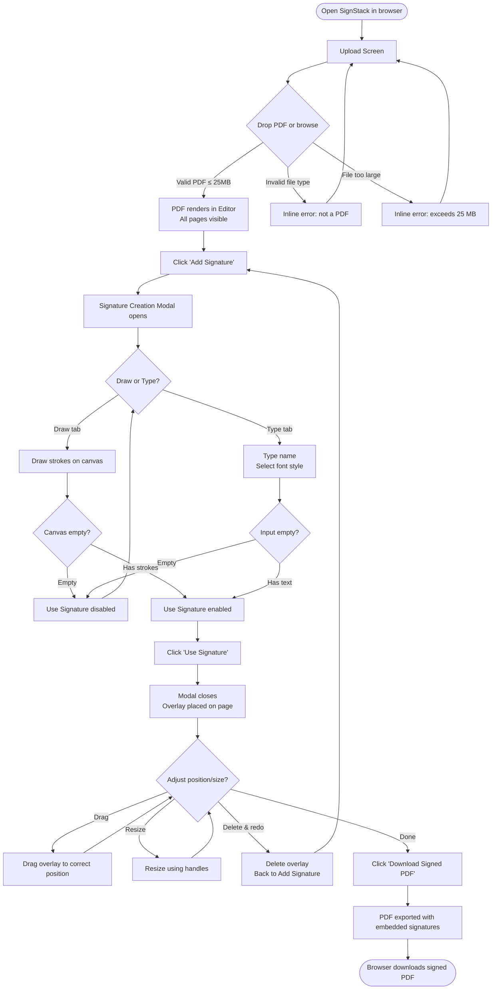
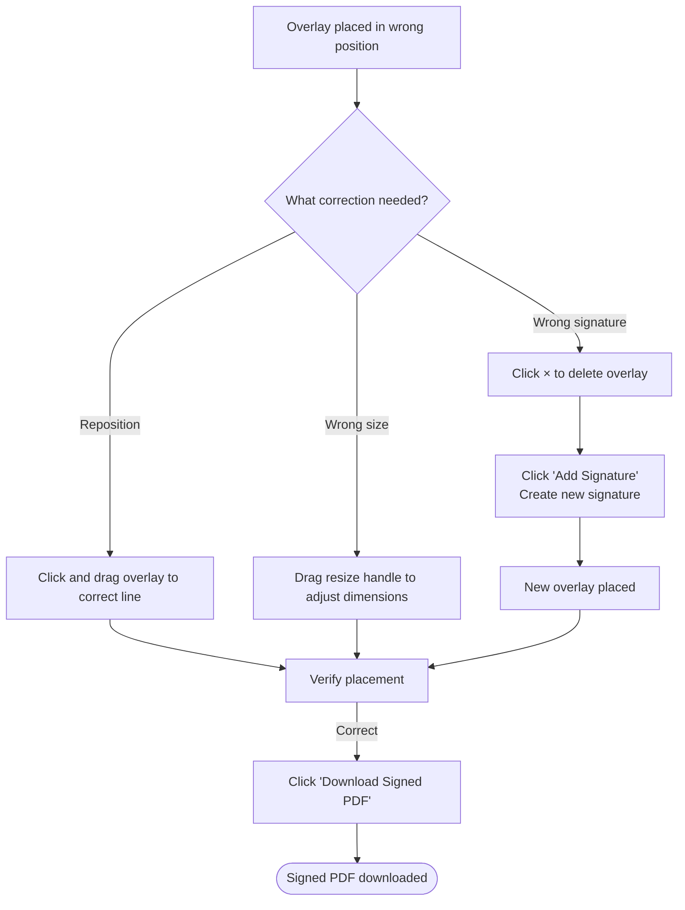
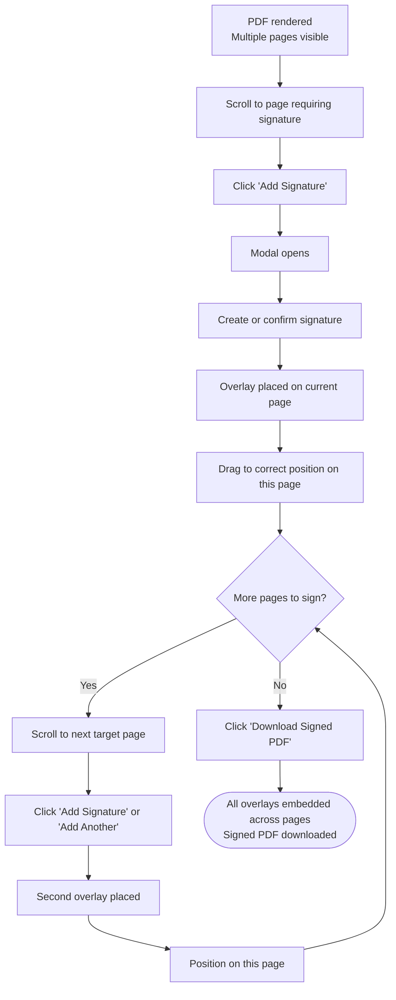

# UX Design Specification: SignStack

**Author:** Jaeson
**Date:** 2026-05-18
**Scope:** MVP 1 — Visual PDF Signing (local-first browser app)

---

## Executive Summary

### Project Vision

SignStack is a privacy-first, browser-based PDF signing tool. The core value proposition is structural: the user's document never leaves their device. The UX must make that guarantee feel real and natural — not through frequent reminders, but through an experience that self-evidently requires no account, no server, and no friction.

MVP 1 delivers one complete workflow: upload a PDF → create a signature (drawn or typed) → place it on any page → download the signed PDF. Every UX decision is made in service of completing that loop in under 2 minutes, with zero onboarding.

### Target Users

**Primary: The Solo Signer.** A freelancer, contractor, or remote worker who frequently receives PDFs to sign. Technically comfortable. Values privacy and speed. Not looking for workflow orchestration. Their mental model: "I just need to put my signature on this and send it back."

**Secondary: The Privacy-Conscious Small Business.** A solo operator or small team that handles sensitive documents and prefers local processing over cloud upload.

### Key Design Challenges

1. **Canvas drawing UX on desktop.** Drawing with a mouse or trackpad is unfamiliar for most users. The typed signature path must be equally prominent and trustworthy.
2. **Overlay placement precision.** Users must position their signature on a specific line within a rendered PDF. The drag/resize experience must feel native and precise, not like a workaround.
3. **Trust without friction.** The privacy guarantee is the product's moat. It must be visible without being alarming or adding steps.
4. **Empty state clarity.** First-time users have no onboarding. The upload screen must communicate the full flow in a glance.

### Design Opportunities

1. **Zero-step onboarding.** The page tells you everything you need to do. No modals, no tutorials, no account creation. Just drop a file.
2. **Typed signatures as first-class.** Most signing tools bury typed signatures. Making Clean/Script/Formal equally prominent serves the majority of users who won't want to draw.
3. **Privacy as design element.** The lock icon and disclaimer aren't warnings — they're differentiators. Styling them confidently rather than anxiously communicates trust.

---

## Core User Experience

### Defining Experience

**SignStack's defining experience:** *"Drop in a PDF, put your signature where it belongs, and download it — all without ever leaving the tab."*

This is the Tinder swipe of PDF signing: one action that users describe to friends. The PDF renders, a signature appears as a draggable element, it snaps onto the document, and a clean signed PDF downloads. No upload dialog, no account prompt, no confirmation email. Done.

### Platform Strategy

- **Primary platform:** Desktop web (Chrome 110+, Firefox 110+, Safari 16+). Mouse and keyboard first.
- **Touch:** Supported incidentally on tablets via the underlying library (react-signature-canvas). Not a primary design target for MVP 1.
- **Mobile:** The layout must not break on mobile viewports, but mobile-optimized flow is not in MVP 1 scope.
- **Offline-capable:** The app works after the initial bundle load. No network required during the signing session.
- **Local dev:** Runs via `next dev`. No CDN, cloud hosting, or infrastructure required for MVP 1.

### Effortless Interactions

The following must require zero thought:

| Interaction | Target Behavior |
|------------|----------------|
| Uploading a PDF | Drag-and-drop onto the entire upload zone — no precise targeting needed |
| Opening signature creation | One clearly labelled button: "Add Signature" |
| Switching draw/type modes | Two tabs, immediately visible, no nested menus |
| Placing the overlay | Signature appears instantly on the page; user drags immediately |
| Exporting | One button: "Download Signed PDF" — no dialog, no options, immediate download |

### Critical Success Moments

1. **The file renders.** First page appears within 3 seconds. The user sees their actual document — this confirms the app works.
2. **The signature snaps onto the page.** After confirming signature creation, an overlay appears immediately on the PDF. The user can drag it to the right line.
3. **The download lands in the downloads folder.** The signed PDF appears in the user's OS download manager. This is the completed task.

### Experience Principles

1. **Document first.** The rendered PDF is the primary UI element. Everything else is chrome.
2. **Two clicks to a signature.** "Add Signature" → confirm → overlay placed. No wizard, no multi-step dialog.
3. **Privacy is ambient.** The trust signal (lock icon + disclaimer) is always visible but never obstructs.
4. **Fail gracefully, recover immediately.** Errors are inline, specific, and dismissible. Nothing crashes the session.

---

## Desired Emotional Response

### Primary Emotional Goals

- **Confidence.** "This is doing what I think it's doing." The user trusts the result before they download it.
- **Efficiency.** "That was faster than I expected." The signature was placed in one drag. The export was one click.
- **Control.** "I can fix this before I send it." The overlay can be moved, resized, or deleted at any point.

### Emotional Journey

| Stage | Desired Feeling | Design Response |
|-------|----------------|----------------|
| Landing on the page | Oriented, not overwhelmed | Single clear action (upload zone) with a one-line privacy badge |
| Uploading the PDF | Confident the right thing is happening | Immediate rendering, no loading spinner longer than 3 seconds |
| Drawing/typing signature | Creative license, low stakes | Clear canvas, easy undo (clear button), equally good typed alternative |
| Placing the overlay | In control, precise | Smooth drag, resize handles visible, overlay snaps visually to document |
| Before export | Satisfied, verified | User can see the signed page before downloading |
| After download | Done, no loose ends | No modal, no "what's next?" prompt — the job is complete |

### Emotions to Avoid

- **Anxiety.** No "are you sure?" dialogs for normal actions.
- **Confusion.** No ambiguous icon-only controls. Labels on all primary actions.
- **Distrust.** No UI patterns that look like tracking, upsell, or data collection.

### Design Implications

- **Confidence → clear visual feedback.** Overlay shows the signature faithfully. Export produces a visually accurate result.
- **Efficiency → remove every optional step.** No save confirmation, no format options, no share sheet.
- **Control → undo-friendly.** Overlay can be repositioned or deleted at any time before export.

---

## UX Pattern Analysis & Inspiration

### Transferable Patterns

| Source Pattern | Borrowed From | Application in SignStack |
|---------------|--------------|--------------------------|
| Drag-and-drop file upload | Figma, Dropbox | Full-zone drop target on upload screen; not a small button |
| Floating toolbar on selection | Google Docs, Figma | Overlay controls appear on selection, not in a fixed sidebar |
| Canvas draw → confirm | Signature pads (DocuSign, HelloSign) | Draw tab with explicit "Use Signature" confirmation |
| Tab switcher for input modes | Browser DevTools, Notion | Draw / Type tabs in the signature creation panel |
| Inline error messages | Stripe, Linear | Error messages appear inline in the upload zone, not as modals |
| Persistent privacy badge | Privacy-first tools | Lock icon + disclaimer always visible in the footer |

### Anti-Patterns to Avoid

| Anti-Pattern | Why Avoided |
|-------------|------------|
| Upload progress bars that hang | Creates anxiety — show instant render instead |
| Multi-step wizard for signature | Too much friction for a single action |
| Account upsell after export | Conflicts with the privacy-first identity |
| Floating signature tools as a scrolling sidebar | Clutters the document view |
| Drag handles invisible until hover | Users won't discover them without visible affordances |
| Export behind a confirmation dialog | Adds a step where none is needed |

---

## Design System Foundation

### Design System Choice

**Tailwind CSS utility-first with a custom token layer.** Tailwind CSS is pre-selected (from the tech stack). The UX design aligns fully with this choice: utility classes define layout and spacing, and a small set of design tokens (colors, type scale, border radius) enforces visual consistency without a heavy component library.

No third-party component library (Material UI, Chakra, etc.) is used. Components are built from scratch using Tailwind utilities, keeping the bundle lean and the visual identity fully custom.

### Design Tokens

```
// Colors
--color-surface:     #FFFFFF        (document pane background)
--color-bg:          #F5F5F4        (app background)
--color-border:      #E5E7EB        (card/panel borders)
--color-text-primary: #111827       (headings, labels)
--color-text-muted:  #6B7280        (secondary text, disclaimers)
--color-accent:      #2563EB        (primary CTA — trustworthy blue)
--color-accent-hover:#1D4ED8        (hover state)
--color-danger:      #DC2626        (error states)
--color-success:     #16A34A        (success states — not heavily used in MVP 1)
--color-overlay-bg:  rgba(37,99,235,0.08)  (overlay fill — hint of accent)
--color-overlay-border: #2563EB    (overlay selection border)

// Signature Canvas
--color-ink:         #1E1B4B        (drawn signature stroke — near-black with slight blue, ink-like)

// Typography
--font-ui:           system-ui, -apple-system, 'Segoe UI', sans-serif
--font-size-base:    16px
--font-size-sm:      14px
--font-size-xs:      12px
--line-height-base:  1.5

// Signature Font Styles (typed signatures only)
--font-clean:        'Caveat', cursive        (casual handwriting)
--font-script:       'Dancing Script', cursive (flowing script)
--font-formal:       'Pinyon Script', cursive  (traditional signature)

// Spacing (8px grid)
--space-1: 8px   --space-2: 16px   --space-3: 24px
--space-4: 32px  --space-6: 48px   --space-8: 64px

// Border radius
--radius-sm: 4px   --radius-md: 8px   --radius-lg: 12px

// Shadows
--shadow-card:   0 1px 3px rgba(0,0,0,0.1), 0 1px 2px rgba(0,0,0,0.06)
--shadow-overlay:0 4px 6px rgba(0,0,0,0.07), 0 2px 4px rgba(0,0,0,0.06)
```

### Customization Strategy

Custom components built with Tailwind utilities, inheriting tokens above. Google Fonts (Caveat, Dancing Script, Pinyon Script) loaded only when the Signature Creation panel is opened — deferred load to avoid impacting initial bundle performance.

---

## Visual Design Foundation

### Color System

**Neutral-dominant, single accent.** The UI is primarily white and light gray so the PDF document reads clearly against the background. One accent color (trustworthy blue `#2563EB`) marks all primary actions and the active overlay border. No competing accent colors in MVP 1.

**Semantic mapping:**
- Primary action (buttons, active states): `--color-accent`
- Overlay border (selected): `--color-overlay-border`
- Error: `--color-danger`
- Muted text (disclaimer, page numbers): `--color-text-muted`
- Document pane: white, no background color — the PDF renders on white

**Contrast:** All text/background combinations meet WCAG 2.1 AA (4.5:1 minimum for normal text, 3:1 for large text and UI components).

### Typography System

**UI typography:** System font stack (`system-ui, -apple-system, 'Segoe UI', sans-serif`). Fast, legible, no custom font download for UI chrome. Used at 16px base with 14px for secondary labels and 12px for captions and disclaimers.

**Signature fonts (typed signatures only, loaded on demand):**

| Style Name | Font | Character |
|-----------|------|----------|
| Clean | Caveat | Casual, legible handwriting |
| Script | Dancing Script | Flowing cursive |
| Formal | Pinyon Script | Classic formal signature |

**Type scale:**

| Role | Size | Weight | Usage |
|------|------|--------|-------|
| Label / Button | 14px | 500 | Toolbar labels, tab labels |
| Body | 16px | 400 | Disclaimer, instructions |
| Caption | 12px | 400 | Page numbers, muted hints |
| Signature preview (typed) | 32px | 400 | Live preview in creation panel |

### Spacing and Layout

**8px grid.** All spacing uses multiples of 8px (8, 16, 24, 32, 48, 64). This enforces visual rhythm without a strict layout framework.

**Layout density:** Spacious. The PDF canvas is the hero; the toolbar is compact (48px tall). Generous padding inside the upload zone and signature panel creates breathing room without wasted space.

---

## Design Direction Decision

**Direction: Document Canvas with Ambient Chrome**

The primary visual direction places the rendered PDF pages front and center in a clean white scroll area. All UI controls — toolbar, disclaimer, overlays — are secondary elements that frame the document without competing with it.

**Key characteristics:**
- White document pane on a light gray app background. The PDF renders as a card with a subtle shadow.
- Top toolbar: flat, white, borderless separator. 48px tall. Logo left, primary actions right.
- Overlay: blue dashed border with corner and edge resize handles. Light blue fill tint.
- Signature Creation: modal overlay. Not a side panel (would compete with document view).
- Bottom bar: privacy disclaimer in muted text, always visible.

**Rationale:** Figma, Notion, and Linear all use this pattern — minimal chrome, maximum content area. It signals "professional tool" without the heaviness of enterprise software. The document as hero also reinforces the privacy message: the PDF is front and center because it never goes anywhere else.

---

## Information Architecture

### Surface Map (MVP 1)

```
┌───────────────────────────────────────────────────────────────┐
│                    UPLOAD SCREEN (initial state)              │
│  ┌──────────────────────────────────────────────────────────┐ │
│  │ Upload zone (drag-and-drop + browse button)              │ │
│  └──────────────────────────────────────────────────────────┘ │
│  Privacy badge + Disclaimer (below upload zone)               │
└───────────────────────────────────────────────────────────────┘
                          │ PDF loaded
                          ▼
┌───────────────────────────────────────────────────────────────┐
│                    EDITOR (post-upload state)                 │
│  ┌──────────────────────────────────────────────────────────┐ │
│  │ Top Toolbar                                              │ │
│  │  [Logo] [+ Add Signature]           [↓ Download PDF]    │ │
│  └──────────────────────────────────────────────────────────┘ │
│  ┌──────────────────────────────────────────────────────────┐ │
│  │                   PDF Scroll Area                        │ │
│  │   ┌──────────────────────────┐                          │ │
│  │   │  Page 1 (rendered)       │                          │ │
│  │   │  [Overlay if placed]     │                          │ │
│  │   └──────────────────────────┘   Page 1 of N            │ │
│  │   ┌──────────────────────────┐                          │ │
│  │   │  Page 2 (rendered)       │                          │ │
│  │   └──────────────────────────┘   Page 2 of N            │ │
│  └──────────────────────────────────────────────────────────┘ │
│  ┌──────────────────────────────────────────────────────────┐ │
│  │ Bottom Bar: 🔒 Local only · [Disclaimer text]            │ │
│  └──────────────────────────────────────────────────────────┘ │
└───────────────────────────────────────────────────────────────┘
                     │ "Add Signature" clicked
                     ▼
┌───────────────────────────────────────────────────────────────┐
│              SIGNATURE CREATION MODAL (overlay)              │
│  Title: "Create Signature"          [×]                       │
│  ┌─────────────┐  ┌───────────────────────────────────────┐  │
│  │ [Draw][Type]│  │ Canvas/Preview area                   │  │
│  └─────────────┘  └───────────────────────────────────────┘  │
│  Controls: [Clear]                  [Cancel] [Use Signature]  │
└───────────────────────────────────────────────────────────────┘
```

**Navigation:** Single-page application. No routing in MVP 1. State transitions:
- Upload Screen → Editor: triggered by valid PDF load.
- Editor → Signature Creation: triggered by "Add Signature" button.
- Signature Creation → Editor: triggered by "Use Signature" (confirm) or "Cancel".
- Editor → File download: triggered by "Download Signed PDF".
- Reset to Upload Screen: only via page refresh. No explicit "start over" button in MVP 1.

---

## Screen Specifications

### Screen 1: Upload Screen

**Layout (desktop 1280px):**

```
┌─────────────────────────────────────────────────────────────┐
│ [SignStack]                                         [?]      │  ← 48px toolbar
├─────────────────────────────────────────────────────────────┤
│                                                             │
│                                                             │
│            ┌─────────────────────────────────┐             │
│            │                                 │             │
│            │    ↑                            │             │
│            │                                 │             │
│            │   Drop your PDF here            │             │
│            │   or  [Browse files]            │             │
│            │                                 │             │
│            │   PDF files only · Max 25 MB    │             │
│            │                                 │             │
│            └─────────────────────────────────┘             │
│                                                             │
│                                                             │
├─────────────────────────────────────────────────────────────┤
│  🔒 Your PDF stays on your device, always.                  │
│  SignStack adds visual signatures to PDFs. It does not      │
│  create certificate-based digital signatures.               │
└─────────────────────────────────────────────────────────────┘
```

**Behavior:**
- The entire upload zone is a drop target. Not just the icon or button.
- Drag-over state: border changes to `--color-accent`, background tint applied.
- Click anywhere in the zone to open file picker.
- "Browse files" button is styled as a secondary button (not the primary CTA — the whole zone is the CTA).
- On valid file selection: immediate transition to Editor. No loading screen unless rendering exceeds 500ms (in which case show a page-level loading indicator).
- On invalid file: inline error message replaces the subtitle line. Error is dismissible. The zone remains active.

**Upload zone states:**

| State | Visual |
|-------|--------|
| Default | Dashed gray border, muted text |
| Drag over (valid) | Blue border, light blue background tint |
| Drag over (invalid) | Red border, light red background tint |
| Loading | Spinner replaces the upload icon |
| Error | Red inline message below the zone |

---

### Screen 2: Editor

**Layout (desktop 1280px):**

```
┌─────────────────────────────────────────────────────────────┐
│ [SignStack]    [+ Add Signature]            [↓ Download PDF] │  ← 48px toolbar
├─────────────────────────────────────────────────────────────┤
│                                                             │
│    ┌───────────────────────────────────────────────────┐   │
│    │                                                   │   │
│    │  ┌─────────────────────────────────┐             │   │
│    │  │                                 │             │   │
│    │  │          PDF PAGE 1             │  ← card,   │   │
│    │  │                                 │    shadow  │   │
│    │  │    ┌──────────────────────┐     │             │   │
│    │  │    │ [Sig] [✕]            │╗    │  ← overlay │   │
│    │  │    └──────────────────────┘╝    │             │   │
│    │  │                                 │             │   │
│    │  └─────────────────────────────────┘             │   │
│    │                     Page 1 of 3                  │   │  ← caption
│    │                                                  │   │
│    │  ┌─────────────────────────────────┐             │   │
│    │  │          PDF PAGE 2             │             │   │
│    │  └─────────────────────────────────┘             │   │
│    │                     Page 2 of 3                  │   │
│    └───────────────────────────────────────────────────┘   │
│                                                             │
├─────────────────────────────────────────────────────────────┤
│  🔒 Local only  ·  SignStack adds visual signatures to PDFs.│
│  It does not create certificate-based digital signatures.   │
└─────────────────────────────────────────────────────────────┘
```

**Toolbar (48px, sticky top):**
- Left: Logo (`SignStack` wordmark, links to refresh/reset)
- Center: `+ Add Signature` — primary action button (accent blue, label + icon)
- Right: `↓ Download Signed PDF` — primary action button (accent blue)
- Both primary actions are visible at all times. No overflow menu.
- If multiple overlays exist, `+ Add Signature` label changes to `+ Add Another` (or keeps same label — UX decision, see OQ-1 in PRD).

**PDF Scroll Area:**
- Centered scroll container with max-width (~794px to match A4/Letter page width at standard zoom).
- Pages rendered vertically with 24px gap between pages.
- Each page: white card with `--shadow-card`, rounded corners (`--radius-md`).
- Page number caption centered below each page in muted text.
- Scroll is standard vertical scroll; no zoom control in MVP 1.

**Bottom Bar (persistent):**
- Full-width, white background, top border.
- Lock icon + "Local only" label in muted text (left).
- Full disclaimer text: "SignStack adds visual signatures to PDFs. It does not create certificate-based digital signatures." (right-aligned or same line).
- Font size: 12px (`--font-size-xs`), color: `--color-text-muted`.

---

### Screen 3: Signature Creation Modal

**Draw Tab:**

```
┌──────────────────────────────────────────────────────────┐
│  Create Signature                                   [×]  │
├──────────────────────────────────────────────────────────┤
│  [  Draw  ]  [  Type  ]                                  │
│  ─────────────────────────────────────────────────────── │
│                                                          │
│  ┌─────────────────────────────────────────────────────┐ │
│  │                                                     │ │
│  │      Draw your signature using your mouse           │ │
│  │      or trackpad.                                   │ │
│  │                                                     │ │
│  │                                                     │ │
│  │                                                     │ │
│  └─────────────────────────────────────────────────────┘ │
│                                          [Clear]         │
│  ─────────────────────────────────────────────────────── │
│  [Cancel]                          [Use Signature]       │
└──────────────────────────────────────────────────────────┘
```

**Type Tab:**

```
┌──────────────────────────────────────────────────────────┐
│  Create Signature                                   [×]  │
├──────────────────────────────────────────────────────────┤
│  [  Draw  ]  [  Type  ]                                  │
│  ─────────────────────────────────────────────────────── │
│                                                          │
│  Your name                                               │
│  ┌─────────────────────────────────────────────────────┐ │
│  │  Alex Johnson                                       │ │
│  └─────────────────────────────────────────────────────┘ │
│                                                          │
│  Style                                                   │
│  [  Clean  ]  [  Script  ]  [  Formal  ]                 │
│                                                          │
│  Preview                                                 │
│  ┌─────────────────────────────────────────────────────┐ │
│  │                                                     │ │
│  │   Alex Johnson  ← rendered in selected font style  │ │
│  │                                                     │ │
│  └─────────────────────────────────────────────────────┘ │
│  ─────────────────────────────────────────────────────── │
│  [Cancel]                          [Use Signature]       │
└──────────────────────────────────────────────────────────┘
```

**Modal behavior:**
- Triggered by "Add Signature" button in the toolbar.
- Opens centered over the editor, with a dark scrim overlay behind it.
- Default tab: Draw (first time open). Remembers last-used tab within the session.
- Draw tab: The canvas occupies ~60% of the modal height. A single horizontal guideline (thin gray line at the bottom third of the canvas) helps users orient their drawing.
- Type tab: Text input auto-focused. Font style defaults to "Script" (most signature-like).  Selecting a style updates the preview instantly.
- "Use Signature" button: disabled when canvas is empty (Draw) or text input is empty (Type). Becomes enabled as soon as valid input exists.
- "Clear" button: Draw tab only. Clears all strokes from the canvas. Does not close the modal.
- "Cancel" / [×]: Closes the modal without creating a signature. Returns focus to the editor.
- Keyboard: Escape closes. Tab cycles through controls. Enter on "Use Signature" confirms.
- Focus trap: Tab key stays within the modal while it is open.

---

## Overlay Specification

### Overlay Visual Design

**Default state (placed, not selected):**
- Displays the signature image/text faithfully.
- No border or handles visible. Signature appears directly on the page.
- Cursor: `move` (indicates draggable).

**Selected state (clicked):**
- Dashed blue border (`--color-overlay-border`, 1.5px dashed).
- Light blue fill tint behind the signature (`--color-overlay-bg`).
- 8 resize handles: 4 corners + 4 edge midpoints. Handles are 8×8px solid blue squares.
- Delete control: small `×` icon in the top-right corner of the overlay (inside the border). 20×20px touch target. Red on hover.
- Resize cursor on handles; move cursor on the body.

**Overlay interaction states:**

| State | Visual |
|-------|--------|
| Unselected | Signature only, no border |
| Selected | Blue dashed border + resize handles + delete icon |
| Being dragged | 85% opacity, `move` cursor, no selection border |
| Being resized | Resize cursor on active handle, live dimension update |
| Hover (unselected) | Cursor changes to `move`, subtle border hint |

### Overlay Placement

- After "Use Signature" is confirmed, an Overlay appears immediately on the page currently visible in the viewport (the page closest to the center of the scroll area).
- Default position: bottom-right quadrant of the page, inset 5% from each edge.
- Default size: 200px wide × proportional height (based on the signature's aspect ratio). Subject to UX refinement.
- The Overlay is immediately selected and draggable upon placement.

### Drag Behavior

- Click and hold on the Overlay body to drag.
- The Overlay moves with the pointer exactly (no snap, no grid for MVP 1).
- Clamped to the Page bounds: the Overlay cannot be dragged outside the Page edges.
- Release to set position.

### Resize Behavior

- 8 resize handles. Corner handles resize both dimensions simultaneously.
- Edge midpoint handles resize one dimension.
- [ASSUMPTION: A-6 from PRD] Aspect ratio not locked by default. UX may revisit.
- Minimum size: 40×20px (prevents invisible overlay).
- Maximum size: the Page dimensions (cannot be larger than the page).

### Deletion

- Click the `×` icon on a selected Overlay to delete it.
- No confirmation dialog. Deletion is immediate.
- The Overlay's Signature remains in session memory (a new Overlay can be placed immediately).
- Keyboard: `Delete` or `Backspace` key when an Overlay is selected deletes it.

### Multiple Overlays

- Each Overlay is independent. They do not snap or align to each other.
- Clicking on an Overlay selects it and deselects any previously selected Overlay.
- Clicking on empty page space deselects the active Overlay.
- Overlays can overlap (no collision detection in MVP 1).

---

## User Journey Flows

### Flow 1: Full Signing Flow (Primary)



### Flow 2: Correction Before Export (UJ-2)



### Flow 3: Multi-Page Signing



### Journey Patterns

**Navigation:** Scroll-only. No page jumping UI in MVP 1. User scrolls to the target page.

**Decision points:** Two tabs (Draw/Type) and the confirm/cancel in the modal are the only decision points in the primary flow. All other actions are direct manipulations (drag, resize, delete).

**Feedback patterns:**
- Immediate: Overlay appears the moment "Use Signature" is clicked.
- Progressive: Overlay movement and resize are real-time.
- Completion: Browser's native download behavior signals success (OS download notification / download bar).

**Error recovery:**
- Wrong file: dismissed with a click; upload zone stays active.
- Misplaced overlay: drag or delete; no state reset needed.
- Export failure: toast message with retry option; session state preserved.

---

## Component Strategy

### Foundation Components (Tailwind Utilities)

These are assembled from Tailwind utilities without a component library:

| Component | Usage |
|-----------|-------|
| Button (primary) | Add Signature, Download Signed PDF, Use Signature |
| Button (secondary) | Cancel, Browse files |
| Button (ghost/icon) | Clear, ×, [?] help |
| Tab group | Draw / Type in signature creation modal |
| Font style selector | Clean / Script / Formal — styled like a segmented control |
| Modal shell | Signature creation modal (scrim + card + focus trap) |
| Inline error | Upload zone error messages |
| Toast notification | Export failure feedback |
| Badge | Privacy / Lock indicator |

### Custom Components

The following require custom implementation beyond Tailwind utilities:

#### `<SignatureCanvas>`

**Purpose:** Drawn signature capture surface.
**Built with:** `react-signature-canvas` wrapper.
**States:** Empty (shows placeholder text), drawing (pointer active), has-content (strokes exist).
**Anatomy:** `<canvas>` element full-width within the panel, gray baseline guideline (1px), `clear` button below.
**Accessibility:** Not keyboard-navigable in MVP 1. The Typed Signature path is the accessible alternative (NFR-A2). Add `role="img"` and `aria-label="Signature drawing area"`.

#### `<TypedSignaturePreview>`

**Purpose:** Renders the typed name in the selected Font Style as a live preview.
**Built with:** `<div>` with inline font-family applied based on selected style. Google Font loaded on-demand.
**States:** Empty (shows placeholder "Your signature will appear here"), populated (renders text in font).
**Font load behavior:** Fonts are loaded lazily when the Type tab is first activated. Show a brief shimmer placeholder if font hasn't loaded yet.

#### `<SignatureOverlay>`

**Purpose:** Draggable, resizable Overlay positioned on a PDF page.
**Built with:** `react-rnd` wrapper.
**Anatomy:** Outer container (react-rnd bounds), signature image/canvas inside, 8 resize handles (provided by react-rnd), selected-state border and delete icon.
**States:** Unselected, selected, dragging, resizing.
**Keyboard:** When selected, arrow keys nudge position by 1px (or 10px with Shift). `Delete`/`Backspace` removes.
**Accessibility:** `role="img"`, `aria-label="Signature overlay — use arrow keys to reposition, Delete to remove"`. Manages focus when placed.

#### `<PDFPageRenderer>`

**Purpose:** Renders a single PDF page as a canvas element.
**Built with:** `react-pdf` + `pdfjs-dist` wrapper.
**States:** Loading (skeleton/placeholder), rendered, error.
**Accessibility:** `role="img"`, `aria-label="PDF page [N] of [total]"`.

#### `<UploadZone>`

**Purpose:** Drag-and-drop + click-to-browse file upload area.
**Built with:** HTML5 drag-and-drop events + `<input type="file">` (hidden, triggered by click).
**States:** Default, drag-over-valid, drag-over-invalid, loading, error.
**Accessibility:** `role="button"`, keyboard-focusable, Enter/Space triggers file picker. Error message has `role="alert"`.

### Implementation Priority

| Priority | Component | Required For |
|----------|-----------|-------------|
| P1 | `<UploadZone>` | Entry to application |
| P1 | `<PDFPageRenderer>` | Viewing the document |
| P1 | `<SignatureCanvas>` | Drawn signature |
| P1 | `<TypedSignaturePreview>` | Typed signature |
| P1 | `<SignatureOverlay>` | Placing and adjusting signature |
| P2 | Toast notification | Export error feedback |
| P2 | Bottom bar / disclaimer | Privacy requirement |
| P3 | Help / [?] | Optional, post-MVP |

---

## UX Consistency Patterns

### Button Hierarchy

| Level | Style | Usage |
|-------|-------|-------|
| Primary | Solid accent blue, white text, rounded | Add Signature, Download Signed PDF, Use Signature |
| Secondary | Outlined, accent blue text | Cancel, Browse files |
| Ghost/icon | No border, muted text/icon | Clear, × delete, ×  modal close |
| Destructive | Red on hover only (ghost by default) | Overlay delete icon |

**Rules:**
- Maximum two primary buttons visible at once (Add Signature + Download PDF in toolbar).
- Disabled state: 40% opacity, `cursor: not-allowed`. Never hidden — always visible so users understand what the action would be.
- Minimum touch target: 44×44px for all interactive controls.

### Feedback Patterns

| Situation | Pattern | Duration |
|-----------|---------|----------|
| Invalid file dropped | Inline error below upload zone | Until dismissed or new file attempted |
| File too large | Inline error below upload zone | Until dismissed or new file attempted |
| Export failure | Toast notification, top-right | 5 seconds + manual dismiss |
| Empty signature confirmed | Inline message in modal | Until input provided |
| Export in progress | Button loading state | Duration of export (typically < 2s) |
| Overlay placed | Immediate visual (no toast) | Persistent until deleted |

**Error message format:** "[Icon] [Short label]: [Specific message with next step]."
Example: "⚠ Not a PDF: This file appears to be a [detected type]. Please choose a PDF file."

### Form Patterns

One form context in MVP 1: the Type tab's text input.

- Auto-focus on Type tab activation.
- Placeholder text: "Your name" (disappears on first keystroke).
- No character limit displayed. Empty input validation only (no length enforcement in MVP 1).
- Live preview updates on every keystroke with debounce of 100ms (prevents jank on rapid typing).

### Navigation Patterns

- No routing. Single surface transitions via component state.
- The modal has a focus trap. Escape closes it.
- After modal close (confirm or cancel), focus returns to the "Add Signature" button in the toolbar.
- After overlay deletion via keyboard, focus returns to the "Add Signature" button.

### Loading and Empty States

| Surface | Empty State | Loading State |
|---------|------------|---------------|
| Upload Screen | Upload zone with instructions | Spinner within zone |
| PDF Scroll Area | N/A (always has content post-upload) | Page skeleton (gray rectangle at page dimensions) |
| Signature Canvas | Placeholder text: "Draw your signature using your mouse or trackpad." | N/A |
| Typed preview | Placeholder text: "Your signature will appear here." | Font load shimmer |

### Overlay and Modal Patterns

- Modals always have a visible close button [×] in the top-right corner.
- Modals have a dark scrim (background-color: rgba(0,0,0,0.4)) behind them.
- Clicking the scrim does NOT close the modal (prevents accidental dismissal mid-drawing).
- Escape closes the modal (keyboard accessibility).
- Overlays deselect when clicking empty page space.

---

## Responsive Design and Accessibility

### Responsive Strategy

**Desktop (1024px+) — Primary target.**
Full layout as specified: sticky toolbar, centered PDF scroll area at ~794px max-width, bottom bar.

**Tablet (768px–1023px):**
- Toolbar compresses. Button labels may truncate to icons + tooltip. At minimum, both primary actions remain visible.
- PDF scroll area fills available width (no max-width constraint at this breakpoint).
- Signature creation modal remains full-modal (no side-panel conversion).
- Touch events on the Signature Canvas are supported by react-signature-canvas; stylus input works.

**Mobile (<768px) — Not primary, must not break:**
- Toolbar stacks: logo on left, both buttons remain (may use icon-only at smallest widths).
- PDF pages span full viewport width.
- Overlay drag handles are larger (at least 20×20px) to be touch-targetable.
- Signature creation modal is full-screen on mobile.
- Typed signature path is recommended over drawn for mobile (drawing with a finger is imprecise).

### Breakpoint Strategy

| Breakpoint | Range | Key Adaptation |
|-----------|-------|----------------|
| Mobile | < 768px | Full-width PDF, icon-only toolbar at XS, full-screen modal |
| Tablet | 768px–1023px | Compressed toolbar, fluid PDF width |
| Desktop | ≥ 1024px | Fixed-width PDF (794px max), full labels, bottom bar |

**Approach:** Desktop-first (consistent with the primary target), with explicit mobile breakpoints to prevent breakage.

### Accessibility Strategy

**Target compliance:** WCAG 2.1 AA for all UI controls outside the Signature Canvas.

**Key requirements:**

| Area | Requirement |
|------|------------|
| Color contrast | All text/background combinations ≥ 4.5:1 (normal text), ≥ 3:1 (large text, UI components) |
| Focus indicators | Visible focus ring on all interactive elements (2px solid `--color-accent`) |
| Keyboard navigation | Full tab order through toolbar, modal, overlay controls |
| Screen reader | All interactive elements have ARIA labels; error messages use `role="alert"` |
| Touch targets | Minimum 44×44px for all tappable elements |
| Typed signature | Fully keyboard-accessible alternative to drawn signature (FR-7 accessibility note) |
| Overlay keyboard | Arrow key nudge (1px / 10px with Shift), Delete key removes |
| Modal focus trap | Tab cycles within modal; Escape closes |
| Skip link | "Skip to main content" link at top of page (hidden until focused) |

**Canvas accessibility (known limitation):**
The Signature Canvas (`<canvas>`) has limited inherent accessibility. For MVP 1:
- Add `role="img"` and `aria-label="Signature drawing canvas"`.
- The Typed Signature path (fully keyboard-accessible) serves as the accessible equivalent.
- Full canvas keyboard drawing (freehand via keyboard) is a post-MVP enhancement.

**Font size and scaling:** All UI text uses relative units (`rem`). The app remains usable when the browser default font size is increased to 20px.

**High contrast mode:** Tailwind's `dark:` prefix is not used in MVP 1, but the color token system is designed to support a high-contrast override in a future iteration.

### Accessibility Testing Plan

| Test Type | Tool / Method |
|-----------|--------------|
| Automated scan | axe-core or Lighthouse accessibility audit |
| Keyboard-only navigation | Manual tab-through of all flows |
| Screen reader | VoiceOver (Safari/macOS), NVDA (Firefox/Windows) |
| Contrast check | Colour Contrast Analyser against design tokens |
| Touch target audit | Chrome DevTools mobile emulation |

---

## Open UX Questions Resolved

The following open questions from the PRD are resolved by this UX design:

| OQ | Resolution |
|----|-----------|
| OQ-1: Signature reuse | When the user has an existing session Signature, "Add Signature" re-opens the modal pre-populated with the existing signature (Draw: canvas shows prior strokes; Type: input shows prior text). User can confirm immediately (reuse) or clear and redraw/retype. This gives both reuse and redo without a binary choice. |
| OQ-4: Disclaimer placement | Persistent bottom bar. Always visible. Not a modal. Exact text: "SignStack adds visual signatures to PDFs. It does not create certificate-based digital signatures." |
| OQ-5: Aspect ratio lock | Unlocked by default. Holding Shift while resizing locks aspect ratio (standard desktop convention). |
| OQ-6: Export filename | `{original-name}-signed.pdf`. If the original has no extension, append `-signed.pdf`. Non-configurable in MVP 1. |

**Remaining open for architecture:** OQ-2 (touch/stylus QA scope), OQ-3 (25 MB limit validation).

---

## Future UX Expansion Points

**Phase 2 — Text/Date/Checkmark Overlays:**
The Overlay system is designed to generalize. Phase 2 adds new overlay types (text box, date picker, checkmark) following the same drag/resize/delete interaction pattern. The "Add Signature" toolbar button would expand to an "Add" menu or split button: [Add Signature ▾] → Signature / Text / Date / Checkmark.

**Phase 3 — PDF Combining:**
Introduces a document management panel on the left side of the Editor, listing uploaded PDFs with drag-to-reorder. The signing flow continues in the main panel unchanged.
